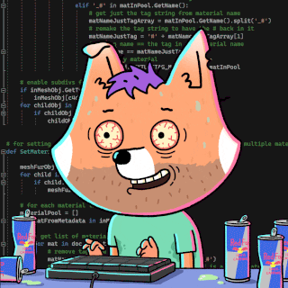

```js
const profile = {
  name: "Patrick Cacdac",
  bio: "Automation Specialist | AI Developer | Programmer",
  url: "patcacdac.com",
  skills: {
   automation: [n8n, GoHighLevel, Zapier, Make],
   frondend: [Javascript, ReactJS, React Native, TailwindCSS, Bootstrap],
   backend: [PHP, Laravel, Flutter, NodeJs, ExpressJs],
   tools: [Git, Github, VSCode, Postman, Docker],
   os: [Mac OS, Windows],
   database: [Mysql, FireBase]
  },
  location: "Manila, Philippines",
  Language: [English, Tagalog],
  hobbies: [Coding, Gaming, Travelling],
};
```

<h2>I'm Patrick Cacdac!👽 </h2>

---

## 🚀 Tech Stack

<p align="center">
  <a href="https://skillicons.dev">
    
  </a>
</p>

---

 ## 📊 Parick's GitHub Stats  
  <a href="#"></a>
  
