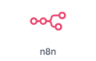
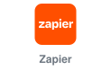
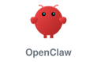
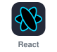
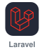
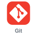

---

 

---

<h2 align="center">🌐 My Socials</h2>

---

<h2 align="center">⚙️ My Tech Arsenal</h2>

<h3 align="center">⚡ Automations & AI Agents</h3>

 

<h3 align="center">🎨 Frontend</h3>

<h3 align="center">⚙️ Backend</h3>

<h3 align="center">🗄️ Database & Tools</h3>

