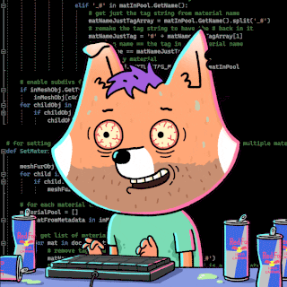

*The first step is to establish that something is possible. Then probability will occur.*

---

 

---

## `import { skills } from "patrick"`

**⚡ Automation & AI**

**🎨 Frontend**

**⚙️ Backend**

**🗄️ Database & Tools**

---

### 🏃 *"I automate so I can outrun my backlog."*

